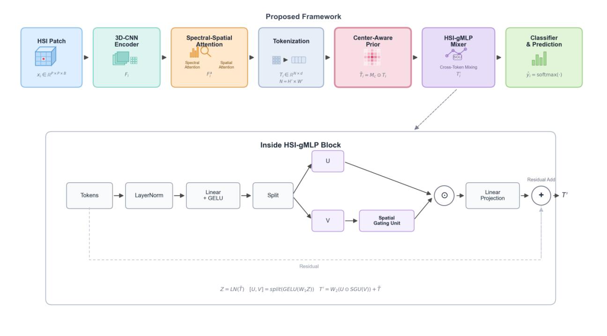
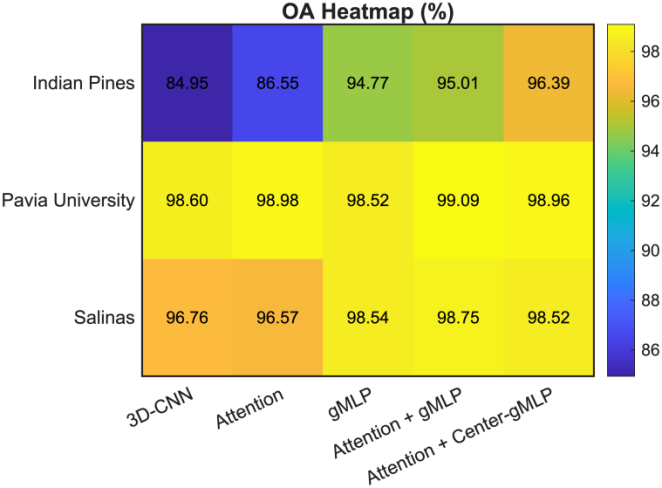
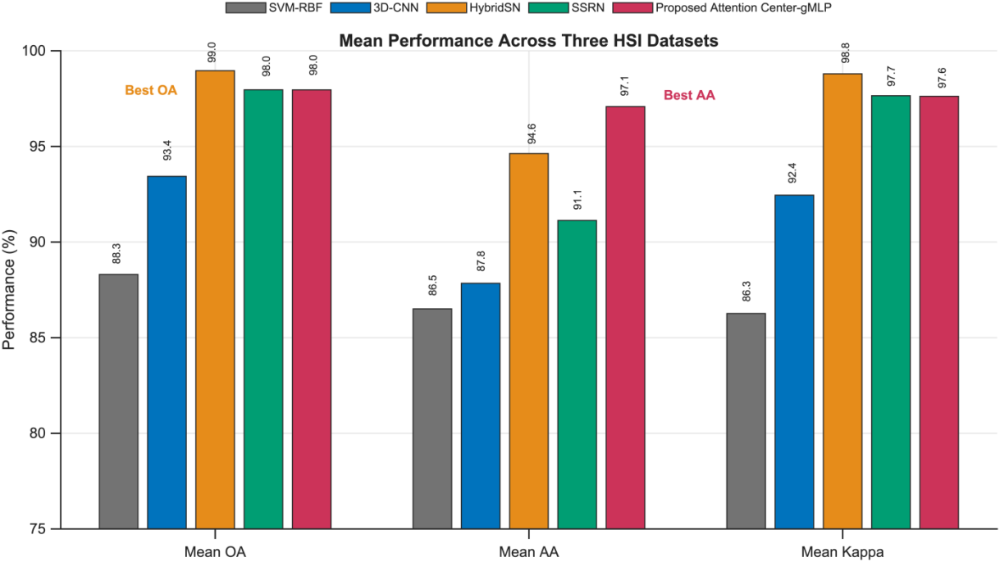
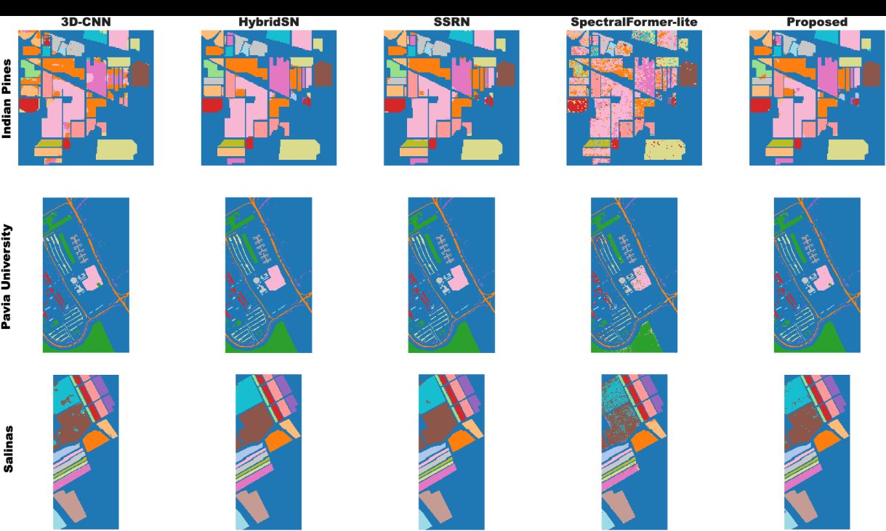
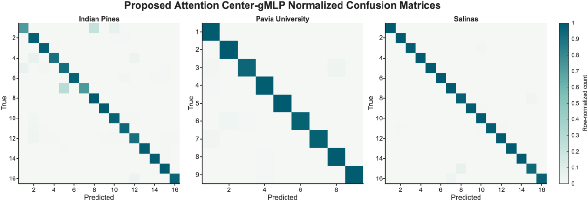
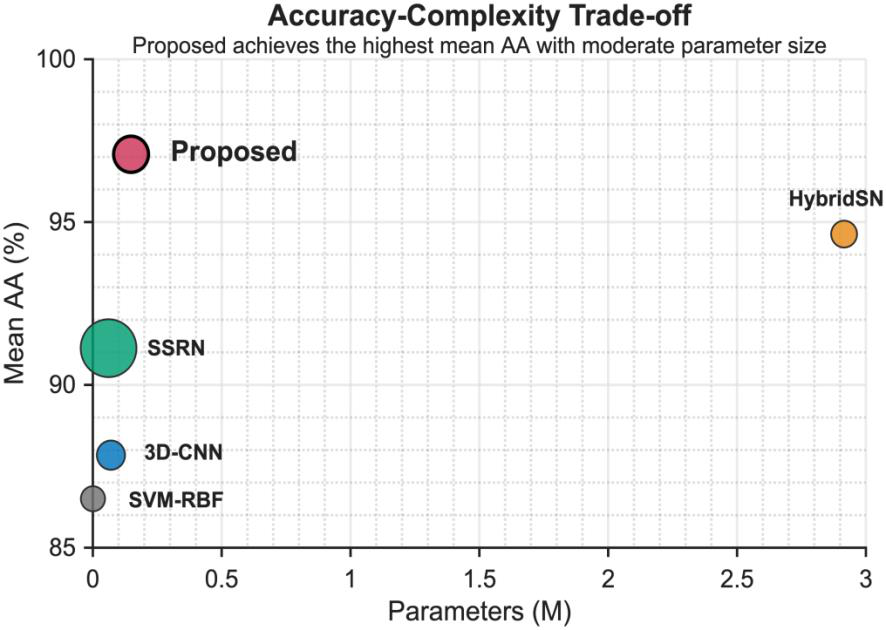
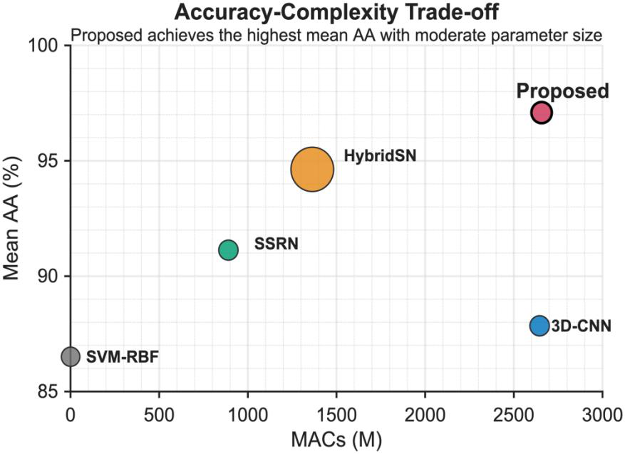

# Center-Aware Attention-Guided gMLP for Hyperspectral Image Classification

**Senior Project, Portland Institute, Nanjing University of Posts and Telecommunications (2025-2026)**

This repository documents a five-member senior project on efficient spectral-spatial representation learning for hyperspectral image classification. The proposed framework combines a 3D-CNN encoder, spectral-spatial attention, a center-aware token prior, and an HSI-specific gMLP token mixer.

> **Repository status:** The documentation, figures, and verified result tables are ready for public presentation. Training code should be added only after it has been cleaned, tested, and approved for release by the project team and supervisor.

## Why This Problem Matters

Hyperspectral images contain hundreds of correlated spectral bands but usually have limited labeled samples. Patch-based classification creates an additional mismatch: the surrounding pixels provide useful context, while the ground-truth label belongs only to the center pixel. This project studies how to preserve contextual information without treating every spatial token as equally label-defining.

## Method Overview



The framework contains four main components:

1. **3D-CNN spectral-spatial encoder** for local joint spectral and spatial feature extraction.
2. **Spectral-spatial attention** for channel and spatial feature recalibration.
3. **Center-aware token weighting** for softly emphasizing the center region associated with the supervised pixel.
4. **HSI-gMLP token mixer** for efficient cross-token interaction through a Spatial Gating Unit.

Unlike the discarded reconstruction-oriented enhancement branch, the final model is trained only with the classification objective.

## Main Results

The model was evaluated on **Indian Pines**, **Pavia University**, and **Salinas** using OA, AA, Kappa, per-class accuracy, classification maps, confusion matrices, ablation studies, parameter count, and MACs.

### Ablation Summary

| Method | Indian Pines OA | Pavia OA | Salinas OA | Mean OA | Mean AA | Mean Kappa | Params (M) |
|---|---:|---:|---:|---:|---:|---:|---:|
| 3D-CNN | 84.95 | 98.60 | 96.76 | 93.44 | 87.84 | 92.45 | 0.071 |
| Attention | 86.55 | 98.98 | 96.57 | 94.03 | 86.64 | 93.13 | 0.072 |
| gMLP | 94.77 | 98.52 | 98.54 | 97.28 | 94.58 | 96.82 | 0.147 |
| Attention + gMLP | 95.01 | **99.09** | **98.75** | 97.62 | **97.19** | 97.24 | 0.148 |
| **Attention + Center-gMLP** | **96.39** | 98.96 | 98.52 | **97.96** | 97.08 | **97.62** | 0.148 |

The clearest gain appears on Indian Pines, where OA rises from **84.95%** for the 3D-CNN baseline to **96.39%** for the final model.



### Comparison with Representative Models

| Model | Mean OA | Mean AA | Mean Kappa | Params (M) | MACs (M) | Inference (ms/sample) |
|---|---:|---:|---:|---:|---:|---:|
| SVM-RBF | 88.31 | 86.51 | 86.26 | - | - | 0.079 |
| 2D-CNN | 97.39 | 91.05 | 96.97 | 0.068 | 15.10 | 0.143 |
| 3D-CNN | 93.44 | 87.84 | 92.45 | 0.071 | 2644.72 | 1.597 |
| **HybridSN** | **98.96** | 94.63 | **98.80** | 2.915 | 1363.99 | 0.694 |
| SSRN | 97.96 | 91.13 | 97.65 | 0.061 | 890.78 | 18.242 |
| SpectralFormer-lite | 82.14 | 80.46 | 79.04 | 0.036 | 0.30 | 0.144 |
| **Proposed** | 97.96 | **97.08** | 97.62 | 0.148 | 2656.75 | 4.630 |

The proposed model should **not** be described as universally state of the art. HybridSN obtains the highest mean OA and Kappa in this comparison. The main strength of the proposed framework is the highest **mean AA**, indicating stronger class-balanced recognition.



## Qualitative Results

### Classification Maps



### Proposed-Model Confusion Matrices



### Accuracy-Complexity Trade-Off

| Parameters | MACs |
|---|---|
|  |  |

## Repository Structure

```text
hsi-center-aware-gmlp/
├── README.md
├── CONTRIBUTORS.md
├── CITATION.cff
├── LICENSE-NOTICE.md
├── assets/                 # Architecture and verified result figures
├── results/                # CSV copies of result tables
├── docs/                   # Public project summary and release checklist
├── data/                   # Dataset acquisition and placement instructions
├── src/                    # Add verified model/training code here
├── configs/                # Add reproducible experiment configurations here
└── scripts/                # Add training/evaluation commands here
```

## Reproducibility Status

The public release should eventually include:

- exact train/validation/test split generation;
- fixed random seeds;
- dataset preprocessing and normalization;
- model configuration for each dataset;
- training and evaluation commands;
- ablation configuration files;
- scripts that reproduce OA, AA, Kappa, confusion matrices, and complexity statistics.

Until those files are uploaded and tested, this repository should be presented as a **project documentation repository**, not as a fully reproducible software release.

## Data

The hyperspectral datasets are not included in this repository. See [`data/README.md`](data/README.md) for the expected directory structure. Do not commit large raw datasets to GitHub.

## Project Team and Attribution

This was a team final-year project supervised by **Prof. Jian Xiong**.

Project members listed in the submitted report:

- Jinlong Zhang, listed as **Caedan Zhang** in the report
- Chris Yu
- Dexter Ma
- Jayson Fan
- Osman Xu

This repository is maintained by Jinlong Zhang. The wording “co-developed” should be used unless a specific component can be documented as an individual contribution.

## Report Availability

The original 48-page team report contains student identifiers and information belonging to multiple contributors. It is therefore not included in this starter repository. Publish a redacted copy only after obtaining approval from the project team and supervisor.

A public technical summary is available in [`docs/project_summary.md`](docs/project_summary.md).

## Citation

Before publishing the repository, verify the contributor names and ordering in [`CITATION.cff`](CITATION.cff). GitHub will show a **Cite this repository** option when a valid citation file is present.

## License

No reuse license is granted in this starter version. See [`LICENSE-NOTICE.md`](LICENSE-NOTICE.md). Add an open-source license only after confirming code ownership and obtaining any necessary team or institutional approval.
